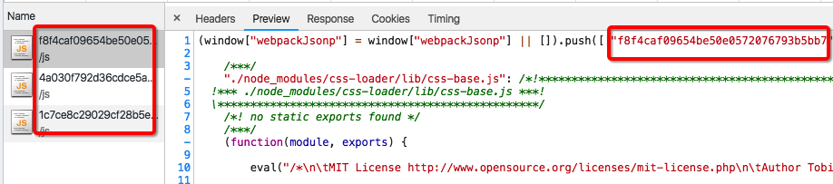

# webpack-hash-chunk-plugin
将打包出来的chunkId使用hash值代替webpack原本的id值

##### 安装

``` npm i webpack-hash-chunk-plugin -D ```

##### 使用

``` JS

const WebpackHashChunkPlugin = require('webpack-hash-chunk-plugin')

module.exports = {
  plugins: [
    new WebpackHashChunkPlugin({
      algorithm: 'md5',  // 哈希算法  md5,sha,sha1,sha256 等
      encoding: 'hex',   // hash编码的方法 只有hex, latin1, base64三个选项
      length: 4 // 生成的hash值的长度  长度值为1~32
    })
  ]
}

```


